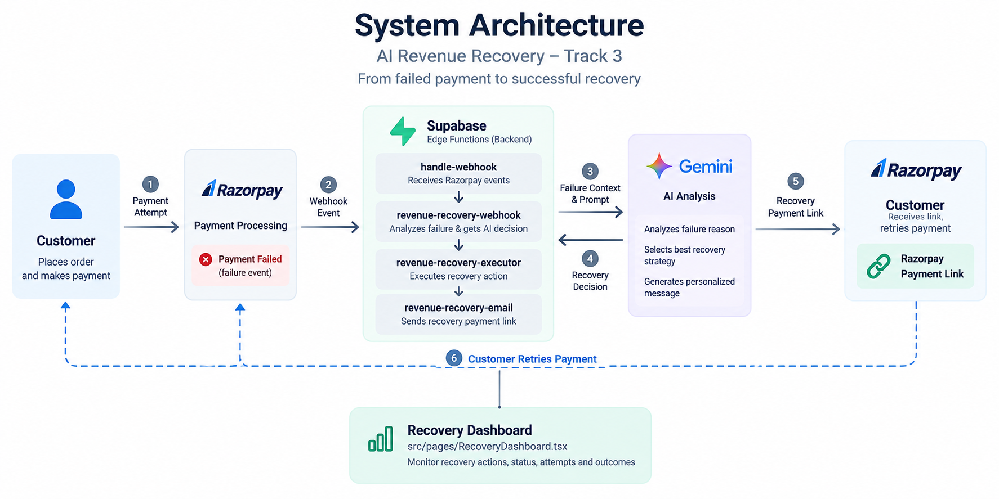

# GrabTheByte — AI Revenue Recovery

GrabTheByte is a working campus-commerce application for campus food ordering and online payments.

For the Razorpay AI Buildathon, we implemented **Track 3 — AI Revenue Recovery** as a real end-to-end recovery system inside the application.

## AI Revenue Recovery



The system turns a failed payment into a controlled recovery flow:

```text
Payment Failure
      ↓
Razorpay Webhook
      ↓
AI Analysis
      ↓
Recovery Decision
      ↓
Recovery Action
      ↓
Razorpay Payment Link
      ↓
Customer Retry
      ↓
Payment Reconciliation
      ↓
Order Recovered
```

## What We Built

- Detects Razorpay payment failures through webhooks
- Uses AI to analyze failure context and select a recovery strategy
- Applies recovery policies and stopping conditions before acting
- Supports **UPI, Card, Netbanking and Wallet** recovery paths
- Creates and delivers a Razorpay Payment Link for recovery
- Tracks actual customer payment attempts across sequential recovery actions
- Reconciles successful and failed retry payments through Razorpay webhooks
- Provides recovery visibility through the dashboard

The result is a **working recovery loop**, not an AI recommendation alone.

## Track 3 Implementation

This repository contains the complete GrabTheByte application.

For the **AI Revenue Recovery** implementation, start with these files:

```text
supabase/functions/
│
├── handle-webhook/
│   └── Razorpay payment event handling
│
├── revenue-recovery-webhook/
│   └── AI recovery decision and orchestration
│
├── revenue-recovery-executor/
│   └── Executes the selected recovery action
│
└── revenue-recovery-email/
    └── Delivers the recovery Payment Link

src/pages/
└── RecoveryDashboard.tsx
    └── Recovery monitoring and visibility
```

## Run Locally

```bash
git clone <repository-url>
cd GrabTheByte
npm install
npm run dev
```

Then open the local URL provided by Vite.

> The complete working Razorpay payment-recovery flow is demonstrated in the 5-minute video.

## Demo

**5-minute working demonstration**

Failed payment → AI recovery → recovery Payment Link → customer retry → successful reconciliation.
